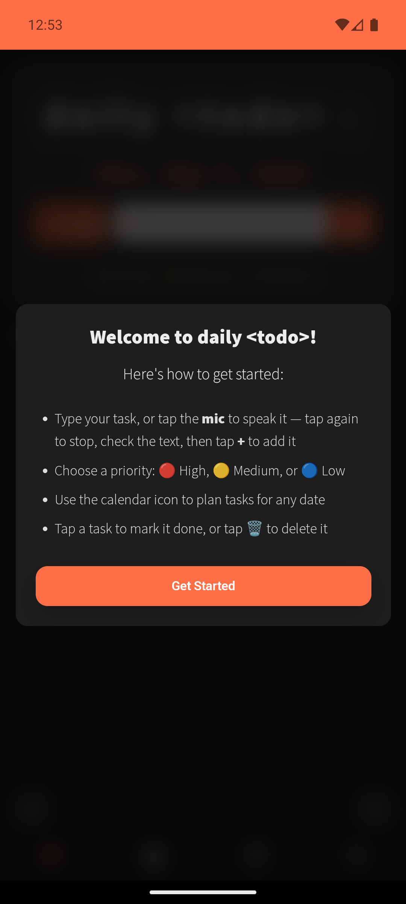
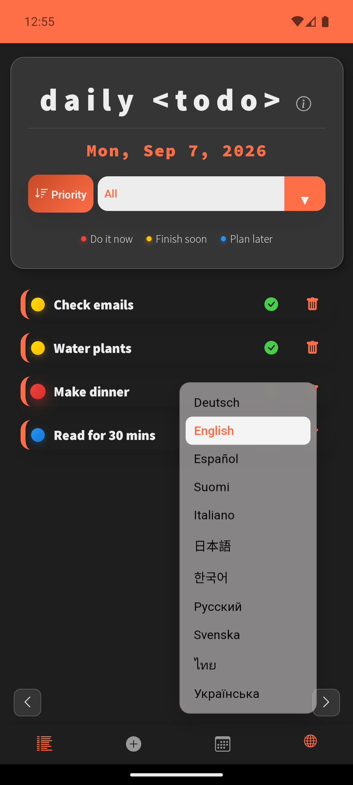
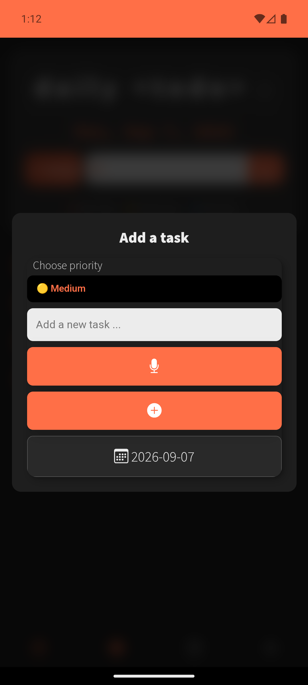
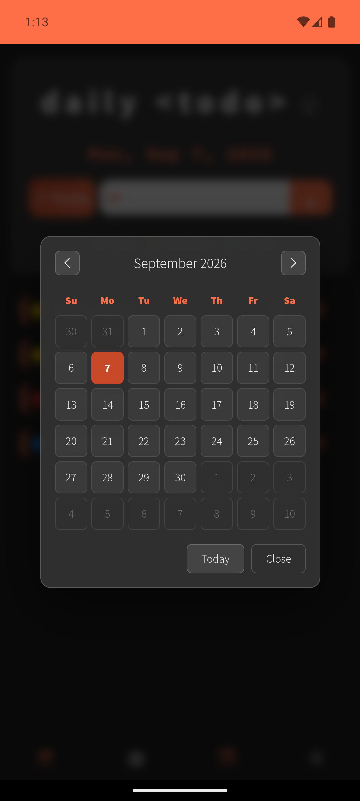

# Daily Todo List

A responsive daily task planner with priority levels, filtering, sorting, calendar view, and voice-powered task input. Built as a personal project to practice vanilla JavaScript, PWA features, and serverless API integration.

## Live Demos

This project has two versions, deployed separately:

| Version | Description | Stack | Live Link |
|---|---|---|---|
| **Full version (this repo)** | Complete app with speech-to-text for hands-free task input, calendar view, and 11-language support | Vanilla JS/HTML/CSS + Node.js serverless functions | [daily-todo-app(full version)](https://dailytodo-xi.vercel.app) |
| **Simple version** | Lightweight core todo app with no backend dependencies | Vanilla JS/HTML/CSS only | [daily-todo-simple](https://mareerray.github.io/daily-todo-simple) |

The simple version is kept as a standalone, dependency-free snapshot for anyone who wants to see the core todo logic without the added speech-feature complexity. This repository (`main` branch) is the actively developed, full-featured version.

## Features

- Add, edit, delete, and complete tasks with priority levels (high, medium, low)
- Confirm dialog on completing a task, with an option to repeat the same task tomorrow
- Confirm dialog before deleting a task, to prevent accidental removal
- Reprioritize tasks by editing their priority level — doubles as manual reordering, since the list sorts by priority
- Filter and sort tasks by priority, status, and date
- Swipe left/right on touchscreen devices to move between days (phones, tablets, touchscreen laptops); arrow buttons handle date navigation on desktop/trackpad
- Calendar view with date-based navigation for daily planning
- Color-coded calendar dots highlight incomplete tasks by status: overdue, due today, or upcoming
- Voice input: add a task by speaking, transcribed via speech-to-text
- Celebration animation and confetti when a task is completed
- Supports 11 languages for task management and calendar view
- Installable as a Progressive Web App (PWA) on desktop and mobile
- Responsive design tested across browsers, phones, tablets, and older devices

## Screenshots

<div>
   
</div>

## Planned / In Progress

- Voice playback (text-to-speech read-back of tasks)
- Optional due time for tasks

## Tech Stack

- **Frontend:** Vanilla JavaScript, HTML, CSS
- **Backend:** Node.js serverless functions (`stt.js`, `tts.js`) for speech processing, deployed on Vercel
- **PWA:** Web App Manifest, offline-friendly design
- **Storage:** Browser local storage for task persistence

## Project Structure

```
daily-todo-list/
├── index.html            # Main app entry point
├── manifest.vercel.json  # PWA manifest for Vercel deployment
├── sw.js                 # Service worker for PWA/offline support
├── translations.json     # 11-language translation strings
├── api/                  # Node.js serverless functions (Vercel)
│   ├── stt.js            # Speech-to-text endpoint
│   └── tts.js            # Text-to-speech endpoint (in progress)
├── js/
│   ├── app.js             # App initialization
│   ├── calendar.js        # Calendar view logic
│   ├── i18n.js             # Language switching / translations logic
│   ├── storage.js         # Local storage read/write
│   ├── todos.js           # Task CRUD logic
│   └── ui.js              # DOM rendering and UI interactions
├── css/                  # Stylesheets
└── package.json          # Node dependencies for serverless functions
```

## Running Locally

```bash
git clone https://github.com/mareerray/daily-todo-list.git
cd daily-todo-list
npm install
```

Set up any required environment variables for the speech-to-text API key, then run the project locally using Vercel's CLI for full serverless function support:

```bash
vercel dev
```

## Author

Built by [Mayuree Reunsati](https://github.com/mareerray) as a self-directed learning project exploring frontend development, PWA capabilities, and API integration.

- GitHub: [@mareerray](https://github.com/mareerray)
- LinkedIn: [Mayuree Reunsati](https://linkedin.com/in/mayuree-reunsati)

## Acknowledgments

Initial project structure inspired by Dev Ed's Vanilla JavaScript tutorial. Significantly enhanced with custom features including priority system, filtering, sorting, and modern UI design.
